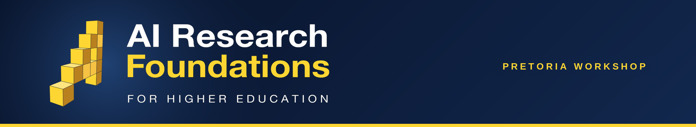

# AIMS AI Research Foundations - Pretoria Workshop

Materials for the Pretoria lecturer workshop (South Africa Workshop 1) of the **Africa AI Upskilling Programme** — AI Research Foundations for Higher Education.

## 🎓 About

The Pretoria week brings the continental rollout of the AI Research Foundations lecturer training to South Africa: Google DeepMind's curriculum, UCL's lecturer toolkit, and AIMS training and mentoring the lecturers — hosted by the University of Pretoria at its Faculty of Economic and Management Sciences (Hatfield campus), for lecturers and teaching assistants from the University of Pretoria and partner universities.

📅 **Dates:** Wednesday 16 – Tuesday 22 September 2026 (five teaching days: 16, 17, 18, 21 and 22 September; no sessions over the weekend)  
📍 **Venue:** Pretoria, South Africa · hosted at the University of Pretoria  
👥 **Audience:** AI Champions — university lecturers and teaching assistants  
🗓️ **Live schedule:** [airf.aims.ac.za/workshops/pretoria-2026/schedule](https://airf.aims.ac.za/workshops/pretoria-2026/schedule/) · [add the workshop calendar to your Google Calendar](https://calendar.google.com/calendar/u/0/r?cid=c_ea4b82263eb8355fafe246d27ae6acfd3625f6e13f1363131ab470ef5f793672@group.calendar.google.com)

## 🚀 What You Will Do

- 🧠 **Learn** - Build a strong foundation in machine learning, neural networks, natural language processing, and large language models through lectures and hands-on labs.
- 👨‍🏫 **Teach** - Develop practical teaching and facilitation skills using the curriculum, and practise explaining technical concepts through peer teaching and structured feedback.
- 🌍 **Adapt** - Contextualise course materials for different student backgrounds and local African contexts, and contribute feedback to improve the workshop for future cohorts.
- 🤝 **Connect** - Collaborate with peers across the African AI community and build a network that supports your teaching beyond the workshop.

## Structure

One folder per session on the timetable, in the rough order of the week:

- [`technical-lectures/`](technical-lectures/) - The day's core AI content, one AIRF course per day (C2, C3, C4, C5, C7).
- [`pedagogy-ai-vs-ri/`](pedagogy-ai-vs-ri/) - Introduce Pedagogical Concept + AI vs RI Activities (Wed).
- [`toolkit-walkthroughs/`](toolkit-walkthroughs/) - UCL-toolkit AI + RI activities, worked through as you'd teach them.
- [`explain-it-back/`](explain-it-back/) - Peer-teaching practice with concept cards.
- [`lecture-it-back/`](lecture-it-back/) - Groups deliver a toolkit activity to the room (planning Thu + Fri, deliveries Mon + Tue).
- [`gcsb-onboarding/`](gcsb-onboarding/) - Google Cloud Skills Boost account setup (Thu).
- [`contextualize-for-africa/`](contextualize-for-africa/) - Adapting the materials to local contexts (Thu).
- [`challenge-lab-walkthrough/`](challenge-lab-walkthrough/) - GSP531 challenge-lab debrief (Fri).
- [`capstone/`](capstone/) - Capstone Project Workshop sessions (Fri + Mon).
- [`course-labs/`](course-labs/) - End-of-day Course Lab notebooks.
- `docs/` · `references/` - Course learning objectives, cheatsheets/glossary/reading list.

Each session's slide deck is committed **inside its own folder** once frozen on Drive. The social openers, Workshop Overview and Closing Remarks are Drive-managed and have no folder, as do structural items (breaks, lunch) — see the schedule below.

## 🧪 Today's lab, one click away

Each day's Course Lab opens directly in Google Colab. Day 1 is here now; the other days land as the week goes on. Days 1-4 need no setup; the Day 5 lab runs on a **T4 GPU** and needs a Hugging Face token:

-  **Day 1 · Course 2 — Small Embeddings and Similarity**
- **Day 2 · Course 3 — Neural Network Training & Overfitting** — coming soon
- **Day 3 · Course 4 — A Transformer in 60 Minutes** — coming soon
- **Day 4 · Course 5 — Fine-Tuning a Layer with LoRA** — coming soon
- **Day 5 · Course 7 — Accelerate Your Model** — coming soon; needs a **T4 GPU** and a Hugging Face token

See [`course-labs/`](course-labs/) for the full lab-by-day table.

## Where materials live

- Notebooks, code, and exercises. Versioned, Colab-ready, and forkable for each cohort. Frozen slide decks are committed inside each session's folder.

## Schedule

Five teaching days from Wednesday to Tuesday, with no sessions over the weekend, blending technical lectures, hands-on sessions, peer teaching, and social activities. Times are in South African Standard Time (SAST, UTC+2). The [live calendar](https://airf.aims.ac.za/workshops/pretoria-2026/schedule/) on the workshop site always shows the latest times.

<strong>Day 1 - Wednesday, 16 September 2026</strong>

| Time | Session |
|------|---------|
| 08:30-09:00 | AI Trainer Bingo |
| 09:00-09:30 | Workshop Overview |
| 09:30-10:30 | Course 2 Technical Lecture |
| 10:30-11:00 | Break |
| 11:00-11:30 | Introduce Pedagogical Concept |
| 11:30-12:00 | AI vs RI Activities |
| 12:00-13:00 | Toolkit Activity Walkthrough |
| 13:00-14:00 | Lunch |
| 14:00-15:00 | Explain It Back |
| 15:00-15:30 | Break |
| 15:30-16:30 | Course 2 Lab |

<strong>Day 2 - Thursday, 17 September 2026</strong>

| Time | Session |
|------|---------|
| 08:30-09:00 | Social - Africa Quiz |
| 09:00-10:30 | Course 3 Technical Lecture |
| 10:30-11:00 | Break |
| 11:00-12:00 | Toolkit Activity Walkthrough |
| 12:00-13:00 | Explain It Back |
| 13:00-14:00 | Lunch |
| 14:00-14:30 | Lecture it Back Planning |
| 14:30-15:00 | GCSB Onboarding |
| 15:00-15:30 | Break |
| 15:30-16:30 | Contextualize for Africa |
| 16:30-17:30 | Course 3 Lab |

<strong>Day 3 - Friday, 18 September 2026</strong>

| Time | Session |
|------|---------|
| 08:30-09:00 | Social - Spot the Slop |
| 09:00-10:30 | Course 4 Technical Lecture |
| 10:30-11:00 | Break |
| 11:00-12:00 | Toolkit Activity Walkthrough |
| 12:00-13:00 | Explain It Back |
| 13:00-14:00 | Lunch |
| 14:00-15:00 | Capstone Project Workshop |
| 15:00-15:30 | Break |
| 15:30-16:00 | Challenge Lab Walkthrough |
| 16:00-16:30 | Lecture it Back Planning |
| 16:30-17:30 | Course 4 Lab |

<strong>Day 4 - Monday, 21 September 2026</strong>

| Time | Session |
|------|---------|
| 08:30-09:00 | Social - Conversation Cards |
| 09:00-10:30 | Course 5 Technical Lecture |
| 10:30-11:00 | Break |
| 11:00-12:00 | Toolkit Activity Walkthrough |
| 12:00-13:00 | Explain It Back |
| 13:00-14:00 | Lunch |
| 14:00-15:00 | Capstone Project Workshop |
| 15:00-15:30 | Break |
| 15:30-16:30 | Lecture it Back |
| 16:30-17:30 | Course 5 Lab |

<strong>Day 5 - Tuesday, 22 September 2026</strong>

| Time | Session |
|------|---------|
| 08:30-09:00 | Social - What Would You Do? |
| 09:00-10:30 | Course 7 Technical Lecture |
| 10:30-11:00 | Break |
| 11:00-12:00 | Toolkit Activity Walkthrough |
| 12:00-13:00 | Explain It Back |
| 13:00-14:00 | Lunch |
| 14:00-15:00 | Course 7 Lab |
| 15:00-15:30 | Break |
| 15:30-16:30 | Lecture it Back |
| 16:30-17:00 | Closing Remarks |

